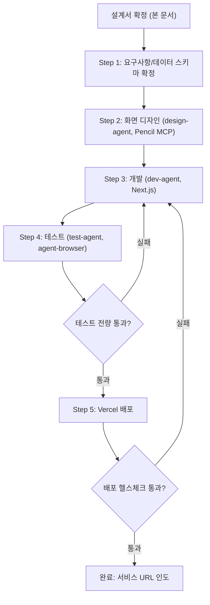
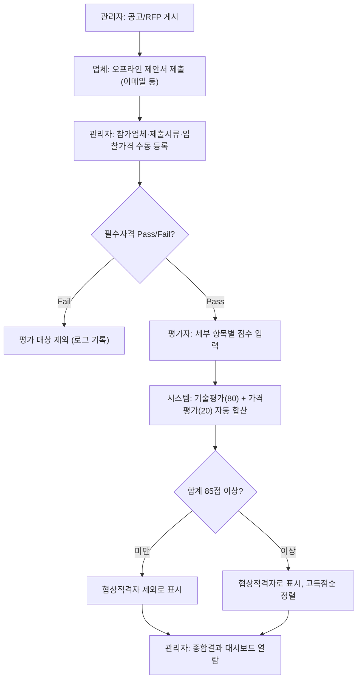

# OK학당 입찰·평가 웹 시스템 에이전트 시스템 설계서

> 작성일: 2026-07-06
> 목적: Claude Code 구현 참조용 계획서

---

## 1. 작업 컨텍스트

### 배경 및 목적

OK금융그룹은 「2025~2026년 OK학당 스마트러닝 교육 위탁운영 용역」계약(2025.9.1~2026.8.31, 1년)의 만료를 앞두고 신규 계약(공개경쟁입찰) 절차를 준비하고 있다. 기존 업체가 재선정될 확률이 높지만, 절차상으로는 "재계약(갱신)"이 아니라 매번 새로 진행하는 계약 선정 절차다. 원 계약은 공개 경쟁입찰 방식(제안서 기술평가 80% + 입찰가격평가 20%)으로 업체를 선정하도록 되어 있으나, RFP 원문에는 "일반부문/콘텐츠부문/운영부문/시스템부문"이라는 4개 대분류 배점 배분만 있을 뿐 **세부 평가 항목과 항목별 배점·채점 기준이 없다**. 이 때문에 매 계약 시마다 평가가 정성적·비일관적으로 이뤄질 위험이 있다.

이 프로젝트는 입찰공고 게시 → RFP 열람 제공 → (오프라인으로 접수된) 제안서 현황 등록 → 세부 평가기준에 따른 평가자 점수 입력 → 자동 집계 및 협상적격자 산출까지를 하나의 웹 시스템으로 구축하여, 평가 과정을 표준화·투명화하고 담당자의 반복 작업(집계, 순위 계산)을 자동화하는 것을 목적으로 한다.

참고로 유사 구조의 기존 시스템(OK뱅크 인도네시아 10주년 행사 대행사 선정 프로그램, `okbank10.lovable.app`)을 벤치마킹했다 — 평가 개요/세부 평가기준/평가 입력/관리자 4-탭 구조, 세부 항목별 배점·채점기준(우수/보통/미흡) 표, 평가자별 점수 입력 후 자동 집계라는 패턴을 그대로 차용하되, 본 시스템은 인증 체계를 이번 단계 범위에서 제외한다(아래 범위 참조).

### 범위

- 포함:
  - **본 시스템의 핵심은 "공고 게시"가 아니라 "(오프라인으로 이미 공고·접수된) 제출자료의 평가·비교"다.** 별도의 공개 열람 페이지는 두지 않고, RFP 원문(사업개요, 제출서류, 참가자격, 일정 등)은 관리자 화면 내 "RFP 참고자료" 탭으로 격하해 필요할 때만 참고하도록 한다.
  - **세부 평가기준표**(신규 설계, 아래 "세부 평가 기준 설계" 참조) 데이터화 및 관리자 "RFP 참고자료" 탭·평가 입력 화면에 표시
  - 관리자가 참가업체/제출서류 현황/입찰가격을 수동으로 등록하는 기능, 제안서 파일 업로드(Supabase Storage)
  - **AI 평가 에이전트**: 업로드된 제안서 파일을 Claude API로 읽어 세부평가기준 항목별 점수·근거를 초안으로 생성 (`ai_evaluation_drafts`). 사람 평가자가 검토·수정 후 저장해야만 실제 평가 점수로 확정됨 — "점수는 사람이 확정한다" 원칙 유지 (2026-07-06 범위 추가, 상세는 `docs/schema.md` 2.6절)
  - 평가자별 항목 점수 입력 및 자동 합계 계산 (기술평가 80 + 가격평가 20)
  - 85점 이상 협상적격자 자동 판정 및 고득점순 정렬, 동점 처리 규칙 적용
  - 관리자 종합결과 대시보드 (업체별/항목별 점수, 협상순위)
  - Supabase(PostgreSQL)를 데이터 저장소로 연동
  - Vercel 배포
- 제외 (이번 단계, 향후 별도 blueprint 대상):
  - 로그인/인증 시스템 (사이트 비번, 평가자별 비번, 관리자 로그인 등) — 사용자가 "로그인 기능은 나중에 구현"으로 명시. 이번 단계는 URL 비공개 공유로 접근 통제를 대체하며, 이는 임시 조치로 문서에 리스크로 명기한다.
  - 전자결재, 계약 체결, 전자서명 등 계약 프로세스 자동화

### 입출력 정의

| 항목 | 내용 |
|------|------|
| **입력** | (1) RFP 원본 Word 문서(`OK금융그룹 2025-2026년 스마트러닝 위탁운영 제안요청서.docx`)에서 추출한 사업개요·일정·참가자격·제출서류 텍스트, (2) 본 설계서에서 확정한 세부 평가기준표(JSON), (3) 관리자가 입력하는 참가업체 정보(업체명, 제출서류 체크, 입찰가격, 제안서 파일 링크 — Google Drive 등 외부 저장), (4) 평가자가 입력하는 항목별 점수(0~배점 범위 숫자) |
| **출력** | Supabase(PostgreSQL) DB에 저장된 참가업체·평가 데이터, 웹 대시보드에 표시되는 업체별/항목별 점수표와 협상적격자 순위표, (선택) 결과 CSV 다운로드 |
| **트리거** | 관리자가 admin 화면에서 "공고 등록"을 실행하면 신규 입찰 건이 생성됨. 평가자가 점수 입력 후 "저장"을 클릭하면 해당 업체의 합계 점수가 자동 재계산됨. 관리자가 "협상적격자 확정"을 클릭하면 85점 기준으로 순위표가 확정됨. |

### 제약조건

- **Supabase 연동 전제조건 (사람이 해야 하는 작업, Claude Code가 대신할 수 없음)**: Supabase 프로젝트 생성, 테이블 마이그레이션 실행, 프로젝트 URL·`anon key`·`service_role key` 발급 및 Vercel 환경변수 등록. Google Sheets 서비스 계정 방식(GCP 프로젝트 생성 + API 활성화 + 시트 공유)보다 절차가 단순하다 — Supabase 프로젝트 생성 후 URL/키 두 개만 발급받으면 된다. 이 단계가 완료되기 전에는 개발 단계(Step 3)에서 실제 데이터 연동 검증이 불가능하다.
- **동시 쓰기 충돌 방지**: `evaluations` 테이블에 `UNIQUE(company_id, evaluator_id)` 제약을 걸고 `INSERT ... ON CONFLICT (company_id, evaluator_id) DO UPDATE`로 upsert한다. Postgres 트랜잭션으로 원자적 처리되므로 중복 행이나 경쟁 조건이 발생하지 않는다.
- **테이블 스키마**: 정규화된 관계형 테이블(`companies`, `criteria`, `evaluations`, 그리고 집계용 뷰 `results_view`)로 설계한다. 이번 단계는 로그인이 없어 서버(서비스 롤 키)에서만 접근하므로 Row Level Security는 비활성 상태로 두되, 향후 인증 도입 시(범위 제외 항목) 반드시 활성화해야 함을 CLAUDE.md에 명시한다.
- 이번 단계는 인증이 없으므로 admin/evaluate 경로의 URL은 비공개로만 공유하고, 실 운영 전 반드시 인증 체계를 추가해야 한다(범위 제외 항목 참조, 리스크로 문서화).
- 세부 평가기준은 RFP 원문에 없던 항목을 이번 설계에서 신규 도출한 것이므로, 실제 평가에 사용하기 전 인사/구매 담당자의 최종 검수·승인이 필요하다.
- Vercel 서버리스 함수의 실행시간·콜드스타트 제약을 고려해 Supabase 클라이언트는 커넥션 풀링(Supabase pooler 엔드포인트)을 사용한다.
- 가격평가(20점)는 표준 정부입찰 산식(최저가 기준 환산)을 기본값으로 적용한다 — 실제 산식이 확정되면 `/lib/scoring.ts` 상수만 교체하면 되도록 분리해서 구현한다.

### 용어 정의

| 용어 | 정의 |
|------|------|
| RFP | 제안요청서(Request for Proposal). 본 사업의 원본 문서는 `OK금융그룹 2025-2026년 스마트러닝 위탁운영 제안요청서.docx` |
| 필수자격 (P/F) | 계약결격사유 없음, 원격평생교육시설 신고 업체 여부 등 통과/탈락으로만 판정하는 자격 게이트 |
| 기술평가 | 제안서 내용에 대한 정성·정량 평가 점수 (배점 80점) |
| 가격평가 | 입찰가격을 정해진 산식으로 환산한 점수 (배점 20점) |
| 협상적격자 | 기술평가+가격평가 합산 총점이 85점 이상인 업체. 고득점순으로 협상 순서가 정해짐 |
| 세부 평가기준표 | RFP의 4개 대분류(일반/콘텐츠/운영/시스템)를 본 설계서에서 세부 항목·배점·채점기준으로 분해한 표 |
| CP사 | Content Partner. 콘텐츠를 제공하는 협력사 |

### 세부 평가 기준 설계 (핵심 산출물)

RFP 원문은 "제안서 기술평가 80% + 입찰가격평가 20%"와 4개 대분류만 정의하고 세부 배점이 없다. 사용자 요청("제안요청서를 확인해서 만들어")에 따라 RFP 본문(용역 수행범위, 세부내용, 제안서 주요 포함항목)을 근거로 아래와 같이 세부 항목·배점을 신규 도출한다. 이 표가 `/data/criteria.json`의 원본이 되며, 구현 단계에서 담당자 검수 후 확정한다.

**배점 총괄**

| # | 평가 영역 | 배점 | RFP 근거 |
|---|-----------|------|----------|
| ① | 필수 자격 | Pass/Fail | Ⅲ.1 참가자격 (계약결격사유, 원격평생교육시설 신고) |
| ② | 일반부문 | 10 pts | Ⅲ.3 "일반부문" + 제안서 포함항목 Ⅰ (일반현황/재무상태/사업수행능력) |
| ③ | 콘텐츠부문 | 25 pts | Ⅲ.3 "콘텐츠부문" + Ⅰ.용역개요 콘텐츠 제공 요구사항 |
| ④ | 운영부문 | 25 pts | Ⅲ.3 "운영부문" + Ⅱ.1 교육 운영 관련 사항 |
| ⑤ | 시스템부문 | 20 pts | Ⅲ.3 "시스템부문" + Ⅱ.2 시스템 운영 및 관리, Ⅱ.3 보안 관련 사항 |
| | 기술평가 소계 | **80 pts** | |
| ⑥ | 가격평가 | 20 pts | Ⅲ.3 "입찰가격 평가 20%" |
| | **합계** | **100 pts** | |

- 협상적격자 기준선: 합계 85점 이상 (RFP Ⅲ.3 선정절차)
- 동점 처리: RFP에 명시된 규칙이 없으므로 OK뱅크 예시를 참고해 "운영부문 → 콘텐츠부문" 순으로 재비교 (구현 시 담당자 확인 필요 — 가정임을 CLAUDE.md에 명시)

**세부 항목 (일부 발췌, 전체는 `/data/criteria.json`에 구현)**

| 영역 | No. | 세부 항목 | 배점 | 확인 서류 |
|------|-----|-----------|------|-----------|
| ① 필수자격 | 0-1 | 계약결격사유 없음 (국가계약법 등) | P/F | 사업자등록증, 법인등기부등본 |
| ① 필수자격 | 0-2 | 원격평생교육시설 신고 업체 여부 | P/F | 신고증빙 |
| ② 일반 | 1 | 경영현황 및 재무안정성 | 4 | 재무제표/부가세과세증명원 |
| ② 일반 | 2 | 사업수행실적(순수 위탁교육 실적) | 4 | 사업수행실적증명서 |
| ② 일반 | 3 | 전담인력 배치계획(PM/R&R) | 2 | 참여인력 구성도 |
| ③ 콘텐츠 | 4 | 보유 콘텐츠 양·다양성(직무/리더십/어학 등) | 8 | 제안서 콘텐츠 목록 |
| ③ 콘텐츠 | 5 | 콘텐츠 최신성 및 업데이트 주기(법정필수교육 포함) | 6 | 제안서 |
| ③ 콘텐츠 | 6 | 생성형 AI·데이터 리터러시 등 신기술 콘텐츠 보유/개발계획 | 6 | 제안서 |
| ③ 콘텐츠 | 7 | 자체 제작 콘텐츠 무상 탑재 및 운영 지원 | 5 | 제안서 |
| ④ 운영 | 8 | 운영전략 및 추진계획의 타당성 | 5 | 제안서 |
| ④ 운영 | 9 | 학습독려 및 참여활성화 방안 | 5 | 제안서 |
| ④ 운영 | 10 | 학습자 관리(콜센터 09~18시, VOC 대응) 체계 | 5 | 제안서 |
| ④ 운영 | 11 | 교육결과 보고 및 사후관리 체계 | 5 | 제안서 |
| ④ 운영 | 12 | 부가서비스(부정수강 모니터링, 맞춤 추천 등) | 5 | 제안서 |
| ⑤ 시스템 | 13 | 웹/모바일 학습 플랫폼 사용 편의성 | 5 | 제안서, 화면 예시 |
| ⑤ 시스템 | 14 | 해외법인(인도네시아·캄보디아 등) 접속 지원 등 안정성 | 5 | 제안서 |
| ⑤ 시스템 | 15 | 정보보안 대책(개인정보보호, DB보안) | 6 | 정보보안 대책서 |
| ⑤ 시스템 | 16 | 장애대응 및 유지보수 체계 | 4 | 제안서 |
| ⑥ 가격 | 17 | 입찰가격 환산 점수 (산식: 20 × 최저입찰가 ÷ 해당업체 입찰가, 소수 둘째자리 반올림, 상한 20점) | 20 | 가격입찰서 |

---

## 2. 워크플로우 정의

이 시스템을 구현하는 작업 자체가 "빌드 파이프라인"이며, 그 결과물인 웹앱 내부의 "업무 처리 흐름"이 별도로 존재한다. 두 가지를 구분해서 정의한다.

### 전체 흐름도 (빌드 파이프라인 — Claude Code가 이 문서를 참조해 실행)



### 제품 운영 흐름 (구현 대상 도메인 로직 — 완성된 웹앱이 실제로 수행하는 업무)



### LLM 판단 vs 코드 처리 구분

| LLM이 직접 수행 | 스크립트로 처리 |
|----------------|----------------|
| 화면 와이어프레임/레이아웃 설계 판단 (design-agent) | 점수 합산 계산 (기술 80 + 가격 20) |
| Next.js/Tailwind/shadcn 코드 구현 및 Supabase 연동 로직 작성 (dev-agent) | 85점 임계값 비교, 협상적격자 필터링·정렬 |
| agent-browser 테스트 시나리오 설계 및 성공/실패 판단 (test-agent) | 필수자격 Pass/Fail 게이트 판정 (체크박스 기반 결정론적 로직) |
| 세부 평가기준 항목·배점의 최초 도출 및 향후 변경 판단 (본 설계서 작업, 재판단 필요 시) | Supabase(PostgreSQL) read/write 쿼리 실행 및 upsert |
| 테스트 실패 로그를 읽고 원인을 dev-agent에게 전달할 수정 지시로 재구성 | 가격평가 산식 계산 (최저가 대비 환산) |

### 단계별 상세

#### Step 1: 요구사항/데이터 스키마 확정

- **처리 주체**: 메인 에이전트 (오케스트레이터, CLAUDE.md)
- **입력**: 본 설계서, RFP 원본 docx
- **처리 내용**: 본 설계서의 세부 평가기준표를 `/data/criteria.json` 스키마로 변환, 화면 목록(공고열람/관리자-업체등록/평가입력/관리자-종합결과) 확정, Supabase 테이블 스키마(`companies`/`criteria`/`evaluations`/`results_view`) 정의
- **출력**: `/data/criteria.json` 초안, 화면 목록·데이터 스키마 문서(`/docs/schema.md`)
- **성공 기준**: 4개 화면과 4개 테이블/뷰, criteria.json의 모든 항목·배점이 빠짐없이 정의됨
- **검증 방법**: 규칙 기반 (표의 배점 합계가 100인지 자동 확인) + 사람 검토
- **실패 시 처리**: 배점 합계가 안 맞는 등 불일치 발견 시 자동 재계산 후 재검증 (최대 2회), 계속 실패하면 에스컬레이션(사용자 확인 요청)

#### Step 2: 화면 디자인 (design-agent)

- **처리 주체**: `design-agent` 서브에이전트, Pencil MCP 사용
- **입력**: Step 1의 화면 목록·데이터 스키마
- **처리 내용**: 공고 열람(공개) / 관리자 업체등록 / 평가 입력 / 관리자 종합결과 4개 화면의 와이어프레임·스타일 설계. `get_guidelines` → `batch_design` → `get_screenshot`으로 시각 검증
- **출력**: `.pen` 디자인 파일, `export_html` 결과물, 화면별 스크린샷
- **성공 기준**: Step 1에서 정의한 4개 화면 모두 디자인 완료 및 스크린샷 확보
- **검증 방법**: LLM 자기 검증 (스크린샷을 보고 레이아웃 깨짐·정보 누락 여부 확인) + 사람 검토
- **실패 시 처리**: 자기 검증 실패 시 자동 재시도 (최대 2회), 계속 실패하면 에스컬레이션

#### Step 3: 개발 (dev-agent)

- **처리 주체**: `dev-agent` 서브에이전트
- **입력**: Step 2 디자인 산출물(스크린샷/HTML), Step 1 데이터 스키마, `/data/criteria.json`
- **처리 내용**: Next.js(App Router) + Tailwind + shadcn/ui로 4개 화면 구현, `/lib/supabase.ts`(Supabase 서버 클라이언트, 업체+평가자 키 기반 upsert 함수 포함), `/lib/scoring.ts`(합산·85점 필터·정렬 로직) 구현, `scripts/migrations/`·`scripts/seed_criteria.ts` 실행으로 초기 데이터 시딩
- **출력**: 소스 코드 (레포지토리 커밋)
- **성공 기준**: `next build` 성공, 타입체크·린트 통과, 초기 시드 데이터가 Supabase DB에 반영됨
- **검증 방법**: 스키마 검증 (빌드 로그의 에러 유무 자동 확인)
- **실패 시 처리**: 빌드/린트 에러 발생 시 에러 로그 기반 자동 재시도 (최대 3회), 계속 실패하면 에스컬레이션

#### Step 4: 테스트 (test-agent)

- **처리 주체**: `test-agent` 서브에이전트, agent-browser 스킬 사용
- **입력**: Step 3의 로컬 dev 서버 또는 Vercel 프리뷰 URL, 테스트 시나리오 목록(아래)
- **처리 내용**: agent-browser로 다음 시나리오를 자동 조작 및 확인 — (1) 공고/RFP 페이지 공개 열람, (2) 관리자 업체 등록(업체명·입찰가격·서류체크 입력), (3) 평가자 점수 입력 후 저장, (4) 합계·85점 필터·협상적격자 정렬이 관리자 종합결과 화면에 정확히 반영되는지 확인. 각 단계 스크린샷 저장
- **출력**: 테스트 결과 로그(`/output/test-report.md`), 시나리오별 스크린샷(`/output/screenshots/`)
- **성공 기준**: 4개 시나리오 전부 기대 결과와 일치 (요소 존재, 계산값 일치)
- **검증 방법**: 규칙 기반 (agent-browser로 추출한 텍스트/값과 기대값 비교)
- **실패 시 처리**: 실패한 시나리오와 원인을 `dev-agent`에게 전달해 재작업 요청 (최대 2회 반복), 계속 실패하면 에스컬레이션

#### Step 5: 배포

- **처리 주체**: 메인 에이전트 또는 `dev-agent`
- **입력**: Step 4를 통과한 코드
- **처리 내용**: Vercel 배포 (`vercel --prod`), 환경변수(Supabase 프로젝트 URL, `service_role key` 등) 설정 확인
- **출력**: 배포 URL
- **성공 기준**: 배포 성공, 헬스체크(홈페이지 200 응답) 통과
- **검증 방법**: 규칙 기반 (HTTP 상태 코드 확인)
- **실패 시 처리**: 자동 재시도 1회, 계속 실패하면 에스컬레이션 (환경변수 누락 등은 사람 확인 필요)

### 상태 전이

**빌드 파이프라인 상태**

| 상태 | 전이 조건 | 다음 상태 |
|------|----------|----------|
| 요구사항확정 | Step 1 산출물(schema.md, criteria.json 배점합계 100) 검증 통과 | 디자인중 |
| 디자인중 | design-agent 4개 화면 완료 | 개발중 |
| 개발중 | dev-agent 빌드 성공 | 테스트중 |
| 테스트중 | test-agent 시나리오 전량 통과 | 배포완료 |
| 테스트중 | 시나리오 실패 | 개발중 (재작업) |
| 배포완료 | 헬스체크 실패 | 개발중 (재작업) |

**제품 운영 상태 (참고 — 완성된 웹앱 내부 상태)**

| 상태 | 전이 조건 | 다음 상태 |
|------|----------|----------|
| 등록대기 | 관리자가 업체 정보 등록 | 자격심사중 |
| 자격심사중 | 필수자격 Pass | 평가중 |
| 자격심사중 | 필수자격 Fail | 평가제외 |
| 평가중 | 모든 평가자 점수 입력 완료 | 집계완료 |
| 집계완료 | 합계 ≥ 85점 | 협상적격 |
| 집계완료 | 합계 < 85점 | 협상제외 |

---

## 3. 구현 스펙

### 폴더 구조

```
/project-root
  ├── CLAUDE.md
  ├── /.claude
  │   ├── /agents
  │   │   ├── /design-agent
  │   │   │   └── AGENT.md
  │   │   ├── /dev-agent
  │   │   │   └── AGENT.md
  │   │   └── /test-agent
  │   │       └── AGENT.md
  │   └── /skills                     # 신규 스킬 없음 (기존 pencil/agent-browser/docx 재사용)
  ├── /app                            # Next.js App Router (4개 탭, 공유 상단 내비게이션)
  │   ├── /page.tsx                   # 평가 개요 (사업정보 요약 + 배점 구성표 + RFP 다운로드)
  │   ├── /criteria/page.tsx          # 세부 평가기준 (criteria.json 전체 상세 표)
  │   ├── /evaluate/page.tsx          # 평가 입력
  │   ├── /admin
  │   │   ├── /page.tsx               # 종합결과 대시보드
  │   │   └── /entries/page.tsx       # 참가업체 등록
  │   └── /api
  │       ├── /companies/route.ts
  │       └── /score/route.ts
  ├── /components
  │   └── /ui                         # shadcn/ui 컴포넌트
  ├── /lib
  │   ├── supabase.ts                 # Supabase 서버 클라이언트 + upsert 함수
  │   └── scoring.ts                  # 합산/85점필터/정렬/가격산식
  ├── /data
  │   └── criteria.json               # 세부 평가기준표 원본
  ├── /scripts
  │   ├── /migrations                 # Supabase SQL 마이그레이션 (companies/criteria/evaluations/results_view)
  │   └── seed_criteria.ts
  ├── /output                         # 테스트 로그/스크린샷
  └── /docs
      ├── schema.md
      └── OK금융그룹 2025-2026년 스마트러닝 위탁운영 제안요청서.docx
```

### CLAUDE.md 핵심 섹션 목록

- 프로젝트 개요: 목적/범위, 계약 배경 한 줄 요약
- 세부 평가기준표 위치 및 변경 규칙: `/data/criteria.json`이 단일 진실 소스임을 명시
- 기술스택 규칙: Next.js App Router / Tailwind / shadcn 사용 컨벤션
- Supabase 연동 가이드: 테이블 스키마(companies/criteria/evaluations/results_view), 서비스 롤 키 사용 원칙, 커넥션 풀링, `UNIQUE(company_id, evaluator_id)` + upsert 규칙, RLS 비활성 상태(인증 도입 전까지)에 대한 리스크 고지
- 서브에이전트 위임 규칙: design/dev/test-agent 트리거 조건과 산출물 전달 방식(파일 경로 기반)
- 인증 관련 주의사항: 현재 인증 없음 — URL 비공개 공유로 임시 대체 중이라는 리스크 고지
- CLAUDE.md 작성 원칙 4가지 (아래 별도 섹션)

### 에이전트 구조

**구조 선택**: 멀티 에이전트 (오케스트레이터 + 3개 서브에이전트)

**선택 근거**: (1) Pencil MCP 디자인 가이드라인, Next.js/Supabase 연동 지식, agent-browser 테스트 문법은 각각 독립적인 도메인 지식이며 전체를 하나의 컨텍스트로 유지하면 지시량이 과도해진다. (2) 사용자가 명시적으로 "디자인/개발/테스트를 subagent로 나눠서 작업"을 요청했다. (3) 세 단계는 순차적이지만 산출물(디자인 파일 → 코드 → 테스트 로그)이 명확히 분리되어 파일 기반 전달이 자연스럽다. → design-principles.md의 sub-agent 분리 기준(독립적 작업 블록 + 서로 다른 도메인 지식)을 충족한다.

#### 메인 에이전트 (CLAUDE.md)
- **역할**: 전체 빌드 파이프라인 오케스트레이션, 서브에이전트 간 산출물 전달, 실패 시 에스컬레이션 판단
- **담당 단계**: Step 1(요구사항 확정), Step 5(배포)

#### 서브에이전트 목록

| 이름 | 역할 | 트리거 조건 | 입력 | 출력 | 참조 스킬 |
|------|------|-----------|------|------|----------|
| design-agent | 화면 와이어프레임/스타일 설계 | Step 1 완료 후(요구사항·스키마 확정 시) | 화면 목록, 데이터 스키마 문서 | `.pen` 파일, 화면별 스크린샷, export_html | pencil (MCP) |
| dev-agent | Next.js 구현 | Step 2 완료 후(디자인 산출물 확보 시) | 디자인 스크린샷/HTML, criteria.json, 데이터 스키마 | 소스 코드 커밋 | (직접 코딩, 별도 스킬 없음) |
| test-agent | 시나리오 테스트 | Step 3 완료 후(빌드 성공 시) | 로컬/프리뷰 URL, 테스트 시나리오 목록 | 테스트 결과 로그, 스크린샷 | agent-browser |

### 스킬/스크립트 목록

| 이름 | 유형 | 역할 | 트리거 조건 |
|------|------|------|-----------|
| pencil (기존 MCP) | 스킬 | 화면 설계 및 스크린샷 기반 시각 검증 | design-agent가 Step 2에서 사용 |
| agent-browser (기존 스킬) | 스킬 | 웹앱 시나리오 자동 조작·검증 | test-agent가 Step 4에서 사용 |
| docx (기존 스킬) | 스킬 | RFP Word 문서 파싱, 세부평가기준 근거 추출 | Step 1 설계 확정 시 사용(본 설계서 작성 과정에서 완료) |
| scripts/migrations/*.sql | 스크립트 | Supabase에 `companies`/`criteria`/`evaluations`/`results_view` 테이블·제약(UNIQUE, FK)·뷰를 생성 | Step 3 개발 착수 직전 1회 실행, Supabase 프로젝트 URL·키 발급이 선행된 이후 |
| scripts/seed_criteria.ts | 스크립트 | `/data/criteria.json`을 Supabase `criteria` 테이블에 시드 데이터로 입력 | Step 3 개발 착수 직전 1회 실행 |

### CLAUDE.md 작성 원칙

이 시스템의 CLAUDE.md는 아래 4가지 원칙을 따라 작성한다. 규칙 나열이 아닌 원칙 중심으로, 50줄 이내로 압축한다.

| 원칙 | 핵심 | 자기 검증 테스트 |
|------|------|-----------------|
| **구현 전에 생각하라** | 세부평가기준·가격산식·동점처리 규칙은 이번 설계서에서 가정한 값임을 숨기지 말고, 실제 값이 다를 수 있다는 점을 명시하라 | "내 가정(배점 배분, 가격산식, 동점규칙)을 명시적으로 진술했는가?" |
| **단순함 우선** | 로그인/인증, 온라인 제안서 업로드 등 범위 제외 항목을 구현하려 하지 마라 | "시니어 엔지니어가 '요청하지 않은 기능이다'라고 할까?" |
| **수술적 변경** | 세부평가기준 수정 요청 시 `/data/criteria.json`과 그 값을 참조하는 부분만 고치고, 화면 레이아웃 전체를 다시 만들지 마라 | "모든 변경 줄이 요청에 직접 연결되는가?" |
| **목표 중심 실행** | 각 Step의 성공 기준(빌드 성공, 시나리오 전량 통과, 배점 합계 100)을 검증한 뒤에만 다음 Step으로 진행하라 | "성공/실패를 객관적으로 판단할 수 있는가?" |

**트레이드오프**: 이 가이드라인은 신중함(가정 명시, 범위 준수) 쪽에 편향되어 있다 — 실제 계약·평가에 쓰이는 시스템이므로 속도보다 정확성을 우선한다. 단, 화면 스타일 등 판단 여지가 큰 부분에는 design-agent의 판단력을 활용한다.

**이 가이드라인이 잘 작동하고 있다면:**
- 세부평가기준이나 가격산식이 바뀌어도 코드 전체가 아닌 `criteria.json`/`scoring.ts` 일부만 수정된다
- 인증 없이 배포되는 리스크를 매번 사용자에게 상기시킨다
- 배점 합계가 100이 아니게 되는 실수가 배포 전에 걸러진다

> 상세 원칙은 `references/design-principles.md` › "CLAUDE.md / AGENTS.md 작성 원칙" 참조.

### 스킬 생성 규칙

이번 빌드에서는 기존 스킬(pencil, agent-browser, docx)만 재사용하며 신규 스킬 생성은 필요하지 않다. 다만 향후 이 시스템에 "RFP 자동 파싱기" 같은 재사용 가능한 신규 스킬이 필요해지는 경우, 아래 규칙을 따른다.

> 이 설계서에 정의된 모든 스킬은 구현 시 반드시 `skill-creator` 스킬(`/skill-creator`)을 사용하여 생성할 것.
> 직접 SKILL.md를 수동 작성하지 말 것 — 규격 불일치 및 트리거 실패의 원인이 됨.

skill-creator가 보장하는 규격:
1. SKILL.md frontmatter (`name`, `description`) 필수 필드 준수
2. `description`의 트리거 정확도 최적화 (eval 기반 optimization loop)
3. 폴더 구조 (`SKILL.md` + `scripts/` + `references/`) 규격 준수
4. Progressive disclosure: SKILL.md 본문 500줄 이내, 대용량 참조는 `references/`로 분리
5. 테스트 프롬프트 실행 및 품질 검증 완료

### 주요 산출물 파일

| 파일 | 형식 | 생성 단계 | 용도 |
|------|------|----------|------|
| `/data/criteria.json` | JSON | Step 1 | 세부 평가기준표 원본 — 화면 렌더링과 점수 계산의 단일 진실 소스 |
| `/docs/schema.md` | MD | Step 1 | 화면 목록·Supabase 테이블 스키마 정의 |
| `.pen` 디자인 파일 + 스크린샷 | .pen / PNG | Step 2 | 4개 화면 디자인 시안, dev-agent 구현 참고자료 |
| `/app`, `/components`, `/lib` 소스 | TS/TSX | Step 3 | 실제 배포되는 Next.js 웹앱 소스 |
| `/output/test-report.md` + 스크린샷 | MD / PNG | Step 4 | agent-browser 테스트 결과 기록 |
| Vercel 배포 URL | URL | Step 5 | 최종 서비스 접근 주소 |
| Supabase Postgres DB (`companies`/`criteria`/`evaluations`/`results_view`) | PostgreSQL | 운영 중 상시 | 실제 참가업체·평가 데이터 저장소 |

### 검증 체크리스트

- [x] 모든 단계에 성공 기준 / 검증 방법 / 실패 시 처리가 있다
- [x] LLM 판단 vs 코드 처리 구분 표가 채워져 있다
- [x] `CLAUDE.md 작성 원칙` 섹션이 4원칙 + 자기 검증 테스트 + 트레이드오프 + 성공 지표를 포함한다
- [x] `스킬 생성 규칙` 섹션이 있고 `skill-creator`를 명시한다
- [x] 에이전트 구조가 단일/멀티 중 하나로 명시되어 있다
- [x] 표와 섹션에 `TBD` 같은 미완성 표기가 남아 있지 않다

### 설계서 유지보수

이 설계서는 **구현 전 계획**이다. 구현 중 설계가 변경되면 아래 규칙을 따른다:

- **경미한 변경** (파라미터, 파일명 등): 설계서 업데이트 없이 구현 코드에만 반영
- **구조적 변경** (단계 추가/삭제, 에이전트 구조 변경): 설계서의 해당 섹션을 업데이트하고 변경 이유를 `### 변경 이력`에 기록
- **범위 변경** (입출력 변경, 새 기능 추가 — 예: 로그인 기능 추가): 설계서를 재검토하거나 새 blueprint를 작성

**변경 이력**

| 날짜 | 변경 내용 | 이유 |
|------|----------|------|
| 2026-07-06 | 최초 작성 | OK학당 재계약 입찰·평가 웹 시스템 구축을 위한 최초 설계 |
| 2026-07-06 | 데이터 저장소를 Google Spreadsheet → Supabase(PostgreSQL)로 변경 | 트랜잭션 부재로 인한 동시 저장 시 중복 행(경쟁 조건) 문제를 DB 레벨 제약(UNIQUE + upsert)으로 근본 해결하기 위함. 서비스 계정 발급 절차도 더 단순함 |
| 2026-07-06 | 독립된 공개 "공고/RFP 열람" 페이지 개념을 폐기 | 사용자가 "이 사이트는 공고를 올리는 사이트가 아니라 이미 접수된 제출자료를 평가·비교하는 사이트"라고 정정함 |
| 2026-07-06 | 화면 구조를 벤치마킹 사이트(`okbank10.lovable.app`)와 동일한 "평가개요/세부평가기준/평가입력/관리자" 4탭 구조로 재확정. `/`(평가개요)는 사업정보 요약+배점구성표+RFP 다운로드 링크 수준으로 가볍게, `/criteria`(세부평가기준)에서 criteria.json 전체 상세표를 별도 표시 | 사용자가 벤치마킹 사이트의 "평가 개요" 탭 스크린샷을 제시하며 그 수준으로 충분하다고 확인함. 공개/관리자 이분법 대신 인증 없는 현재 단계에 맞게 4탭을 하나의 공유 내비게이션으로 통일 |
| 2026-07-06 | 문서·화면 전반에서 "재계약"이라는 표현을 "계약"으로 정정 (제목 포함) | 사용자가 "재계약이라고 표현하니까 이상하네. 재계약을 할 확률이 높지만 일단 그냥 계약이어야 함"이라고 정정함 — 절차상으로는 매번 새로 진행하는 공개경쟁입찰 계약 선정 절차이지 자동 갱신(재계약)이 아니기 때문 |
| 2026-07-06 | 세부평가기준을 관리자가 화면에서 직접 편집(항목 추가/삭제/배점 조정, **영역 자체도 추가/삭제**)할 수 있도록 아키텍처 변경. `criteria` 테이블이 `/data/criteria.json`을 대체하는 단일 진실 소스가 되고, 배점 합계 등은 항상 실시간 계산. `evaluation_settings` 테이블(협상적격 기준점, 동점 재비교 순서) 신설, `criteria.item_type`에 `'price'` 추가 | 사용자가 "평가 기준과 비중을 관리자가 직접 조정할 수 있도록 해야 함"이라고 요청, 범위를 "영역 자체도 추가/삭제 가능"으로 확정 |
| 2026-07-06 | 디자인을 "모던 대시보드형(카드/그라디언트/데이터시각화 강화)"으로 전면 재설계, 평가개요 화면의 장식용 로고 이미지 제거 | 사용자가 "디자인이 너무 심플하기만 함", "평가 개요 부분에 보이지 않는 로고가 너무 많아. 이런거 필요없어"라고 지적. 원인은 `public/logo-symbol.png`·`logo-wide.png`가 투명여백 과다 크롭되어 정사각형 박스에서 거의 안 보이게 찌그러지는 것으로 확인, 재크롭 대신 장식용 로고 박스 자체를 제거하기로 함 |
| 2026-07-06 | "AI를 이용한 제안서 자동 채점" 범위 제외 항목을 철회하고 **AI 평가 에이전트**를 신규 범위로 추가 (제안서 업로드 → Claude API 채점 → 초안 생성 → 사람이 검토·확정) | 사용자가 "평가 에이전트 구축 필요. 업체에서 보낸 제안서를 업로드하면 에이전트가 동작하여 평가기준에 따른 평가를 수행"이라고 요청. "AI는 초안만 제안, 사람이 검토후 확정해야 점수로 반영"으로 범위 확정해 "점수는 사람이 입력한다" 원칙과 절충 |
